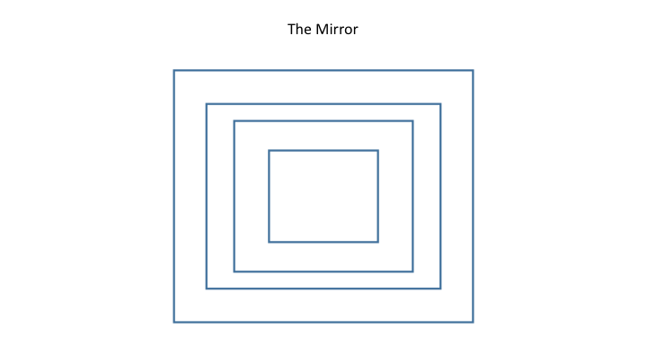
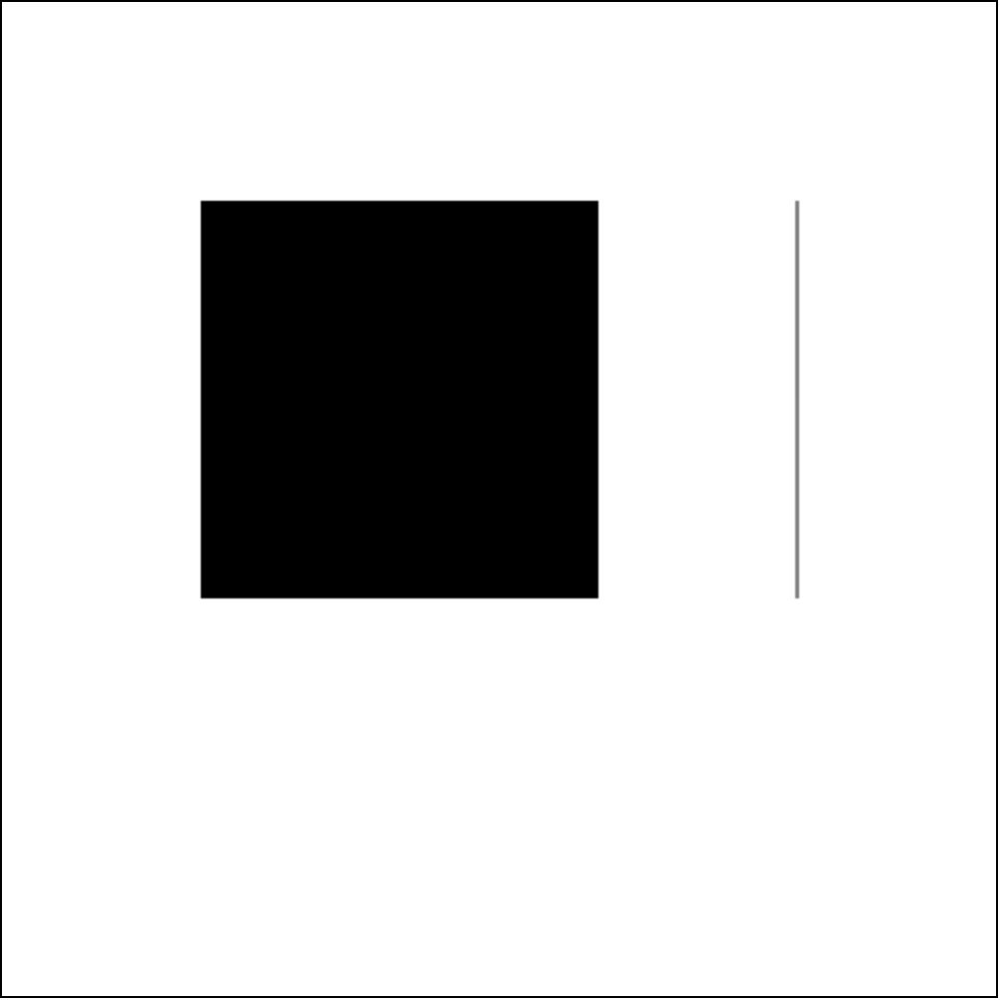

#Advanced HTML5 Layout and CSS3

##New Tags in HTML5
- HTML5 introduced a number of "semantic" tags that give meaning to your markup.
- These new tags play a role in SEO to allow for contextual analysis of content blocks.
- Let's take a look at a list of new semantic tags [here](http://www.w3schools.com/html/html5_new_elements.asp).

##CSS and CSS3 Selectors
- Selectors play a key role in selecting DOM elements for styling.
- There are common selectors that have been around awhile, and also new selectors that give us even more control as of CSS3.
- Let's take a look at some of the most common CSS3 selectors [here](http://www.w3schools.com/cssref/css_selectors.asp).

##Shakespeare's Plays Exercise
- For this exercise we will be using the files [here](shakespeares_plays/).
- Select the `<ul>` with the ID "selected-plays" and place a gray background on it.
- Select the second and third `<h2>` elements (hint: they have classes) and make the font size larger and give them some space below.
- Change the background color of the third row of a table to gray.
- Select the `<li>` elements at the second level of the nested list and change the font color to red.
- Make every other table row in both tables have a gray background.
- Select an anchor tag that has a link to a pdf file. Change the color to blue and increase the font size.
- Select an anchor tag that has an href attribute containing the substring "asyoulikeit" and change the font color to orange.

##Selector Exercise
- Let's use Codepen.io to practice CSS selectors.
- Create at least one div with an id, and four divs with a class.
- Use CSS to apply styling to the divs based on the id and class selectors.
- Bonus: Try implementing one or more styles using a CSS3 selector (first-child, nth-child, first-of-type, etc).

##Floats
- Floating elements allows us to create a nearly unlimited number of layouts using all types of block elements.
- Floating an element essentially removes it from the standard "flow" and places it to the left or right side of its container.
- Elements can have fixed width, which will wrap underneath each other if the container is smaller than the combined widths.
- You can also used percentage width, which will have the columns respond to the screen size.
- You can tell already that the calculations can get out of hand really fast...

##Element Alignment
- To determine how we can align an element we have to first know what kind of element it is.
- Inline elements can be aligned as text, so with the `text-align` CSS property.
- Block elements can be aligned using the space around them - margin. A margin set to auto for both left and right will center the element in a container.

##The Grid Layout
- Most modern layouts operate on a standard 12-column grid system.
- If you break down any of the websites you know and love you will notice many variations on the 12 column grid.
- Each column in the grid can contain nested grids itself.
- If you want a larger box, you need to have a greater column offset.
- Here is a good pictorial to help you break it down:


##Code-Along: Let's Create Our Own Grid
- We will create a 2, 4, and 6 column grid.
- We will try nesting a grid inside another grid.

##CSS Positioning
- There are four main types of positioning that you will see most often - static, relative, absolute, and fixed.
- Static positioning is what all elements have by default. Yay!
- Relative and absolute work together - elements can be positioned absolutely relative to their container.
- Fixed position elements are essentially absolute relative to the window no matter where they are in the DOM. A.K.A. the window is always the relative parent.

##Positioning Exercise
- Try to replicate the following mockups using what we've talked about in this class so far.
- Utilize margins, padding, floats, positioning, etc.

1. Stackers!


2. The Mirror



3. The Skinny


4. The Absolute


#Advanced HTML5 and CSS3
- HTML5 is more than just tags and attributes.
- HTML5 wraps in a rich JavaScript API that helps you push front-end work to the limit.

##Detect HTML5 Features
- In order to use any of the exciting HTML5 features you should make sure they are available on the target browser.
- There are in-built ways to do this, and also a library called Modernizr that makes it easier.

##In-Built Feature Detection
- Check if a certain property exists on a global object (window or navigator for example).
	- Example: Check for geolocation support on the navigator object.
- Create an element, then check if a certain property exists on that element.
	- Example: Test for canvas support.
- Create an element, check if a certain method exists on that element, then call the method and check the value it returns.
	- Example: Test which video formats are supported.
- Create an element, set a property to a certain value, then check if the property has retained its value.
	- Example: Testing which `<input>` types are supported.

##Feature Detection with Modernizr
- Let's take a look at the [Modernizr documentation](http://modernizr.com/).
- Modernizr can detect JavaScript capabilities in addition to CSS3 capabilities.
- Let's take a look at some of the things you can detect:

Canvas Support:

```
Modernizr.canvas
```

Geolocation Support:

```
Modernizr.geolocation
```

Specific Video Formats:

```
Modernizr.video.h264
```

CSS3 Font Face:

```
Modernizr.fontface
```

3D Transforms:

```
Modernizr.csstransforms3d
```

##Browser Storage
- HTML5 has a nice API for storing data locally.
- This substitutes using cookies for storing application-related information.
- There are two main ways - localStorage and sessionStorage, which are part of the global `window` object.
- WebSQL is a cutting-edge SQL data store on the client side that is currently only available on Chrome.

##LocalStorage
- localStorage is essentially a object-based persistent data store.
- You can store up to 5MB of data in localStorage.
- All data is stored in string format only (no objects or arrays).
- localStorage data is persisted until it is cleared either programmatically or manually.
- Let's look at some getter and setter methods for using it:

```
window.localStorage.setItem("key", "value");

window.localStorage.getItem("key");
```

##SessionStorage
- sessionStorage is much like localStorage except it only persists for the current "session."
- When the browser is closed sessionStorage is cleared.
- It has similar getter and setter methods:

```
window.sessionStorage.setItem("key", "value");

window.sessionStorage.getItem("key");
```

##Exercise: Todo List
- Let's create a todo list app using localStorage.
- The HTML is already prepared for you [here](todo_html/).

##HTML5 Canvas
- Canvas allows many kinds of image manipulation through JavaScript.
- You can create static images or dynamic scenes.
- Canvas currently only supports 2D scenes but may support 3D scenes in the near future.

##Canvas Exercise: A Simple Drawing
- We will use canvas to draw a simple line and rectangle.
- The final result will look like this:



Step 1: Select the canvas element

```
var canvas = document.getElementById("my-canvas");
```

Step 2: Get the canvas "context"

```
var canvas_context = canvas.getContext("2d");
```

- The context is what you draw on using JavaScript.

Step 3: Fill the rectangle onto the context

```
canvas_context.fillRect(100, 100, 200, 200);
```

Step 4: Create the line

```
canvas_context.beginPath();

canvas_context.moveTo(400, 100);

canvas_context.lineTo(400, 300);

canvas_context.stroke();
```

##Kinetic JS: A Canvas API
- Canvas is not incredibly intuitive to use, and there is quite a lot you can do with it.
- Canvas APIs such as [KineticJS](http://kineticjs.com/), [PaperJS](http://paperjs.org/), and [RaphaelJS](http://raphaeljs.com/) are commonly used to maximize the canvas potential.
- We will be practicing using KineticJS to create a scene of rectangles that are draggable:


####Everything in Kinetic starts with a "stage" that will contain the canvas:

```
var stage = new Kinetic.Stage({
	container:'container',
	width:700,
	height:500
});
```

####Next we need to create a layer to add elements too:

```
var layer = new Kinetic.Layer();

stage.add(layer);
```

####Add rectangles to layer:

```
for (var i = 0; i < 10; i++) {
	var rect = new Kinetic.Rect({
		x:10 + (i * 20),
		y:10 + (i * 20),
		width:100,
		height:80,
		fill:"#900",
		draggable:true,
		stroke:"#000000",
		strokeWidth:2
	});

	layer.add(rect);
	layer.draw();
}
```

####With canvas you can even save the entire stage to JSON to be retrieved at a later time:

```
localStorage.setItem("rectangle_sample", stage.toJSON());
```

##Exercise: Preserve Canvas State
- In this exercise you will create a new canvas drawing using circles.
- Position the circles wherever you like throughout the canvas.
- Save the canvas to JSON and store in localStorage.
- Upon refresh of the page check if the localStorage property exists and render the canvas as it was.